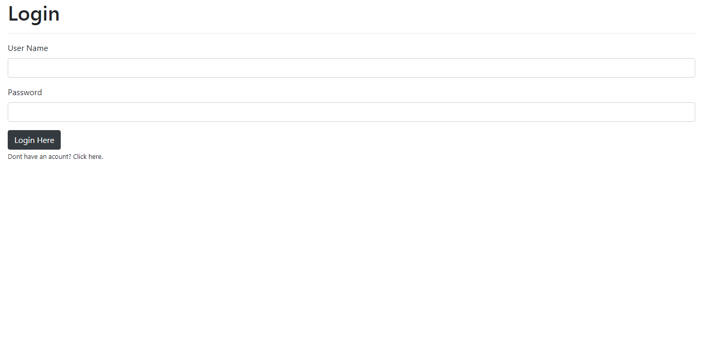
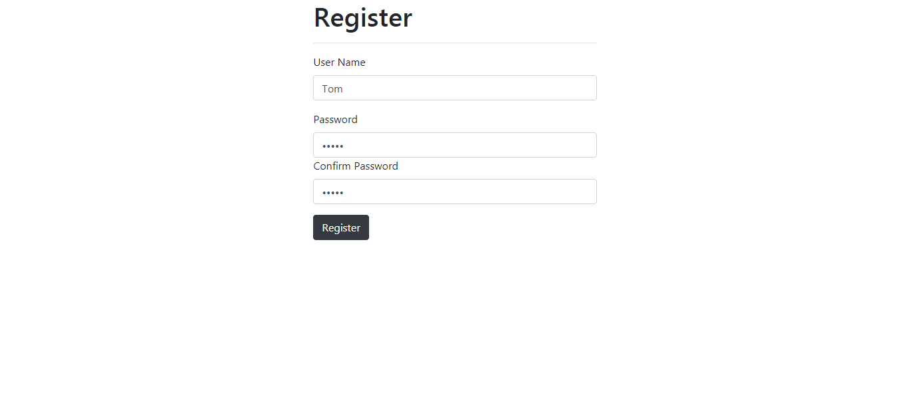
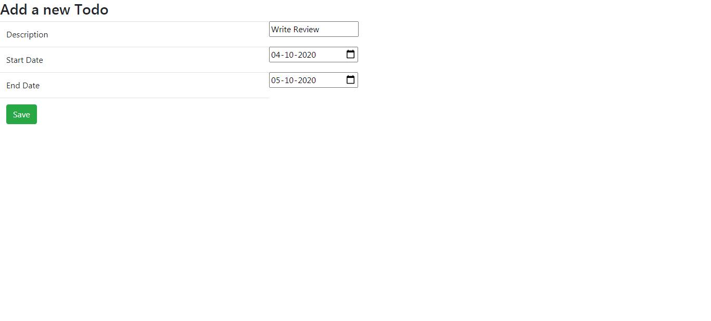

# To-Do App

This project was generated with [Angular CLI](https://github.com/angular/angular-cli) version 9.1.3.

## Getting started

Install node_modules

```npm install``

## Screenshots

{:height="50%" width="50%"}
{:height="50%" width="50%"}
{:height="50%" width="50%"}
{:height="50%" width="50%"}